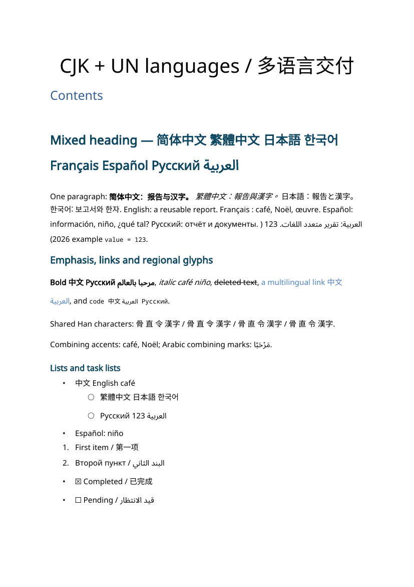

# markdown2docx

中文 | [English](README.md)

把 Markdown 转为可编辑的 Word 文档，支持**简体中文、繁体中文、日语、韩语、英语、法语、西班牙语、俄语和阿拉伯语在同一文件中混排**，包括同一个标题、段落和表格单元格。默认无需提供模板。

项目保留 Pandoc 的文档结构，为文本片段分配授权可核实的开放字体，处理阿拉伯语和双向混排。不会翻译正文。

## 快速开始

需要 Python 3.14+ 和 Pandoc。混排验收使用 Pandoc 3.12，更早版本不在新验收范围内。

```bash
# macOS: brew install pandoc
# Ubuntu/Debian: sudo apt-get install pandoc
# Windows: https://pandoc.org/installing.html
uv sync
uv run markdown2docx examples/multilingual.md -o report.docx --toc --json
uv run markdown2docx --doctor --json
```

原有 Unix 环境脚本可能通过系统包管理器安装 Pandoc；转换过程本身不会安装 Pandoc 或系统字体。安装包后可直接调用 `markdown2docx` 或 `python -m markdown2docx.cli`。本分支的 0.2.0 版本号不表示 PyPI 已完成发布。

## 同一文件中的多语言混排

[综合样例](examples/multilingual.md) 覆盖全部首批语言、组合字符、RTL、粗体、斜体、删除线、链接、列表、任务列表、表格、引用、图片、代码高亮、脚注、目录和公式。

已生成的 [DOCX](examples/output/multilingual.docx)、[PDF](examples/output/preview/preview.pdf) 和 [检查报告](examples/output/report.json) 可直接查看。



目录采用 Word 字段，需要在 Word/LibreOffice 中更新才能填充条目；无界面预览可能只显示目录标题。

```markdown
---
lang: en
---

**[简体中文]{lang=zh-Hans}** [繁體中文]{lang=zh-Hant}
[日本語の漢字]{lang=ja} [한국어]{lang=ko}
[English]{lang=en} [Français : café]{lang=fr}
[Español: niño]{lang=es} [Русский]{lang=ru} [العربية]{lang=ar} 123.

::: {lang=ar dir=rtl}
مرحبا بالعالم مع [English 中文 123 (https://example.com)]{dir=ltr}.
:::
```

普通混排会自动按文字系统选择字体，无需逐字标注。共有汉字无法可靠判断应使用哪种地区字形，请为这些内容添加局部 `lang`。否则先使用段落上下文与主语言，仍有歧义时采用简体字形，并输出提示。

语言使用 BCP 47 标签，接受 `zh-TW`、`en-GB`、`fr-CA` 等变体。全局优先级是 CLI/API → Markdown 元数据 → 环境变量 → 配置文件 → 默认值；局部语言和方向标记覆盖对应内容。未指定方向时，以段落正文的首个强方向字符判断，忽略行内代码；代码块默认 LTR。`--ui-lang zh` 仅影响 CLI，不改变文档语言。

## 字体授权与展示条件

默认使用已核实版本的 Noto Sans、地区 Noto Sans CJK、Noto Sans Arabic、Noto Sans Mono、Noto Sans Math 和 Noto Sans Symbols2。[字体清单](src/markdown2docx/font_manifest.json) 记录官方固定版本、文件校验值及许可证校验值。商用条款参考 [Noto 官方说明](https://notofonts.github.io/noto-docs/website/use/)。

选择顺序是**字节校验匹配的系统字体 → 已核实缓存 → 下载官方固定版本**。相同字体名称不等于授权已核实。下载保留许可证，使用 SHA-256、缓存锁和原子写入，仅获取需要的字体；多个 CJK 地区字体会占用较大的缓存空间。

- 字体仅被引用，不嵌入 DOCX，也不自动安装。缓存字体不代表 Word/LibreOffice 已经能使用它；请在查看文档的机器上安装报告列出的字体，避免替换。
- `--offline` 禁用下载。缺少或损坏的必要字体会明确报错，不静默使用授权未知的字体。
- 显式配置字体及用户模板中的有效字体接受检查。`--allow-unverified-fonts` 仅作为用户明确选择的例外，要求字体已安装，并在报告中保留授权未核实提示。
- macOS 默认缓存位于 `~/Library/Caches/markdown2docx/fonts`，Windows 位于 `%LOCALAPPDATA%/markdown2docx/fonts`，Linux 位于 `$XDG_CACHE_HOME/markdown2docx/fonts` 或 `~/.cache/markdown2docx/fonts`。
- 跨机器分页可能不同；彩色 emoji 不在完整展示保证内，原始 HTML/raw 内容不在完整文本校验范围内，报告会相应标注。

## CLI、API 和报告

```bash
uv run markdown2docx input.md --json --lang fr --direction auto
uv run markdown2docx input.md --ui-lang zh --offline
uv run markdown2docx input.md --template company.docx --toc
uv run markdown2docx input.md --render --preview-dir previews --json
uv run markdown2docx --create-template reference.docx --json
```

JSON 转换结果包含路径、主语言、局部语言、文字系统、字体映射、警告、检查结果和预览。字体记录包括来源、路径、校验值、许可证来源、字重和样式。日志写入 stderr，stdout 仅输出结果 JSON；帮助和版本保持常规 CLI 输出。

错误返回非零退出码和稳定代码，例如 `FONT_UNAVAILABLE`、`FONT_CHECKSUM_FAILED`、`FONT_DOWNLOAD_FAILED`、`FONT_GLYPH_MISSING`、`FONT_LICENSE_UNVERIFIED`、`TEMPLATE_INVALID`、`INVALID_ARGUMENT`、`VALIDATION_FAILED`。

```python
from markdown2docx import MarkdownToDocxConverter

converter = MarkdownToDocxConverter()
path = converter.convert("input.md", "output.docx")  # 仍返回 Path
report = converter.convert_with_report("input.md", lang="en", toc=True)
print(report.to_dict())
```

转换后先检查结构、文本完整性、字体覆盖和语言/方向属性，通过必要检查后原子发布。失败保留已有输出。兼容参数 `--no-validate` / `validate_output=False` 不再关闭这些必要检查。

`--render` 在字体已安装且工具可用时通过 LibreOffice 和 `pdftoppm` 生成 PDF 与页面图片。字体仅在缓存、缺少工具或渲染失败时会明确标注。`rendered` 仅表示生成了预览，不代表已经通过人工视觉验收。

## 配置

通过 `--config config.toml` 使用 TOML 或 YAML：

```toml
[international]
lang = "en"
direction = "auto"
offline = false
allow_unverified_fonts = false
# font_cache = "/your/private/cache"

[template]
page_size = "A4"
margin_cm = 2.54
body_font = "Noto Sans"
heading_font = "Noto Sans"
code_font = "Noto Sans Mono"
body_size_pt = 11
code_size_pt = 9
```

环境变量采用 `MD2DOCX_INTERNATIONAL__LANG`、`MD2DOCX_INTERNATIONAL__OFFLINE` 等形式。显式正文、标题和代码字体配置作用于拉丁文本，CJK 和阿拉伯语采用对应开放字体。用户模板提供版式和样式，多语言字体由转换流程分配。缺失或损坏模板直接失败。

输出拒绝符号链接及 Windows reparse point。POSIX 固定目录描述符；Windows 使用不共享删除权限的目录句柄。必要的安全操作不可用时终止发布。

## Agent skill

[markdown-to-docx](skills/markdown-to-docx/SKILL.md) 附带独立启动脚本，通过 `uv tool run`（`uvx`） 调用固定 Git commit 的执行包，不依赖仓库 checkout。需要 `uv`、Pandoc，首次获取执行包和字体需要网络。

本分支合并后可以安装：

```bash
npx skills add cnkang/markdown2docx --skill markdown-to-docx
```

## 综合验收与 GitHub Actions

```bash
uv sync --group dev
uv run pytest
uv run mypy src/markdown2docx
uv run python scripts/validate_multilingual.py --output-dir artifacts/multilingual
# 安装必要字体、LibreOffice 和 Poppler 后：
uv run python scripts/validate_multilingual.py --offline --render --output-dir artifacts/multilingual
```

Actions 在 Linux、macOS、Windows 上执行转换和检查。临时 Linux runner 会安装已核实的样例字体，生成 PDF 和页面预览，检查 PDF 是否使用预期 CJK、阿拉伯及拉丁字体，上传 `multilingual-<OS>` 产物。人工仍需检查阿拉伯语连接、标点位置和分页。Word/LibreOffice 人工展示检查属于发布门槛；配置了 CI 不等于全部平台已经通过。

更多示例见 [examples](examples/README.md)，行为变化见 [CHANGELOG](CHANGELOG.md)。

## 许可证

项目代码采用 MIT。下载字体保留各自的 OFL 许可证，不重新标记为 MIT。
