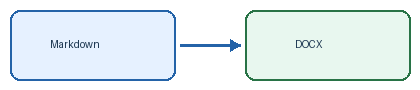

# Mixed heading — [简体中文]{lang=zh-Hans} [繁體中文]{lang=zh-Hant} [日本語]{lang=ja} [한국어]{lang=ko} Français Español Русский [العربية]{lang=ar}

One paragraph: **[简体中文：报告与汉字。]{lang=zh-Hans}** *[繁體中文：報告與漢字。]{lang=zh-Hant}* [日本語：報告と漢字。]{lang=ja} [한국어: 보고서와 한자.]{lang=ko} [English: a reusable report.]{lang=en} [Français : café, Noël, œuvre.]{lang=fr} [Español: información, niño, ¿qué tal?]{lang=es} [Русский: отчёт и документы.]{lang=ru} [العربية: تقرير متعدد اللغات.]{lang=ar} 123 (2026) [example](https://example.com) `value = 123`.

## Emphasis, links and regional glyphs

**Bold 中文 Русский [مرحبا بالعالم]{lang=ar}**, *italic café niño*, ~~deleted text~~, [a multilingual link 中文 العربية](https://example.com), and `code 中文 العربية Русский`.

Shared Han characters: [骨 直 令 漢字]{lang=zh-Hans} / [骨 直 令 漢字]{lang=zh-Hant} / [骨 直 令 漢字]{lang=ja} / [骨 直 令 漢字]{lang=ko}.

Combining accents: [café, Noël]{lang=fr}; Arabic combining marks: [مَرْحَبًا]{lang=ar}.

### Lists and task lists

- 中文 English café
  - [繁體中文]{lang=zh-Hant} [日本語]{lang=ja} [한국어]{lang=ko}
  - Русский [العربية]{lang=ar} 123
- Español: niño

1. First item / 第一项
2. Второй пункт / [البند الثاني]{lang=ar}

- [x] Completed / 已完成
- [ ] Pending / [قيد الانتظار]{lang=ar}

### One cell containing all supported languages

| Context | Mixed content |
|:---|:---|
| All languages | [简体中文]{lang=zh-Hans} [繁體中文]{lang=zh-Hant} [日本語]{lang=ja} [한국어]{lang=ko} [English]{lang=en} [Français café]{lang=fr} [Español niño]{lang=es} [Русский]{lang=ru} [العربية]{lang=ar} 123 (https://example.com) |
| Formatting | **中文 Русский [العربية]{lang=ar}** and `code = 123` |

### Quotations and bidirectional content

> [Citation française : « Bonjour, monde ! »]{lang=fr}
>
> 中文 Русский [مرحبا]{lang=ar} 123.

::: {lang=ar dir=rtl}
#### عنوان عربي مع [English 中文]{lang=en dir=ltr}

مَرْحَبًا بالعالم، **تقرير عربي** مع [English 中文 Русский]{lang=en dir=ltr} و [123 (2026) https://example.com]{dir=ltr}.

- البند الأول [ABC-123]{dir=ltr}
- البند الثاني [中文]{lang=zh-Hans dir=ltr}

| العربية | mixed / 混排 |
|---|---|
| تقرير | [café niño Русский 中文 123]{dir=ltr} |
:::

### Code, footnotes and mathematics

```python
message = "中文 / 繁體中文 / 日本語 / 한국어 / café / niño / Русский / العربية"
print(message)  # preserve whitespace and text order
```

::: {lang=ja}
```text
漢字 骨 直 令
```
:::

A multilingual note[^mixed] and an equation $E = mc^2$, followed by display math:

$$
\int_0^1 x^2\,dx = \frac{1}{3}
$$

[^mixed]: [简体中文]{lang=zh-Hans} [繁體中文]{lang=zh-Hant} [日本語]{lang=ja} [한국어]{lang=ko} English [Français]{lang=fr} [Español]{lang=es} [Русский]{lang=ru} [العربية]{lang=ar} 123.

### Image and horizontal rule



---

End / 结束 / [結束]{lang=zh-Hant} / [終わり]{lang=ja} / [끝]{lang=ko} / fin / fin / конец / [النهاية]{lang=ar}.
